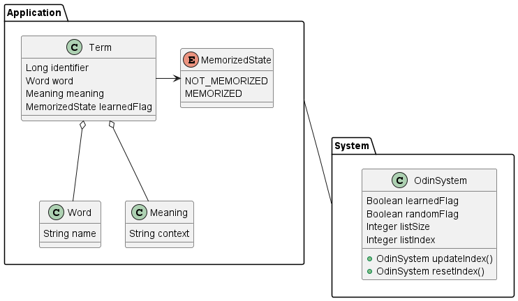

# odin-for-web
## Overview  
Odin for web is a wordbook application that displays multiple words at once.  
This application can be handled as a web service.  

## How to use?
TBD  

## Functionality
- To register new words  
- To delete existing words
- To change the remembered ot unremembered status of a word  
  Provides the ability to display words in the order they were registered or at random.  
- To specify the number of words to display  
  Provides the ability to change the number of words displayed.  

## Development
### Environment
#### Back end
- OpenJDK 17.0.7
- Spring boot 3.1.1
- IntelliJ IDEA 2023.1.2
- embedded H2DB 2.2.220

#### Front end  
TBD, maybe Vite + React...

### Architecture  
  
#### OdinSystem  
OdinSystem is responsible for maintaining for the entire system of this application.   
For example, this entity holds the state of the option such as not displaying words that have been memorized.  
There can only be one OdinSystem entity per application; attempts to create more than one will result in an error.  

#### Term  
Term retains the word itself, meaning, and its status with respect to whether it has been memorized or not.  
It does not accept null for words and their meanings.  
Term entities are created in the Service layer according to the Controller's instructions.